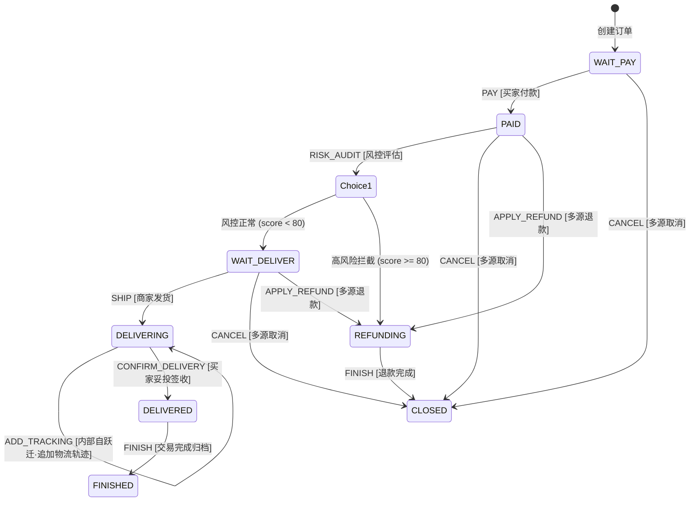
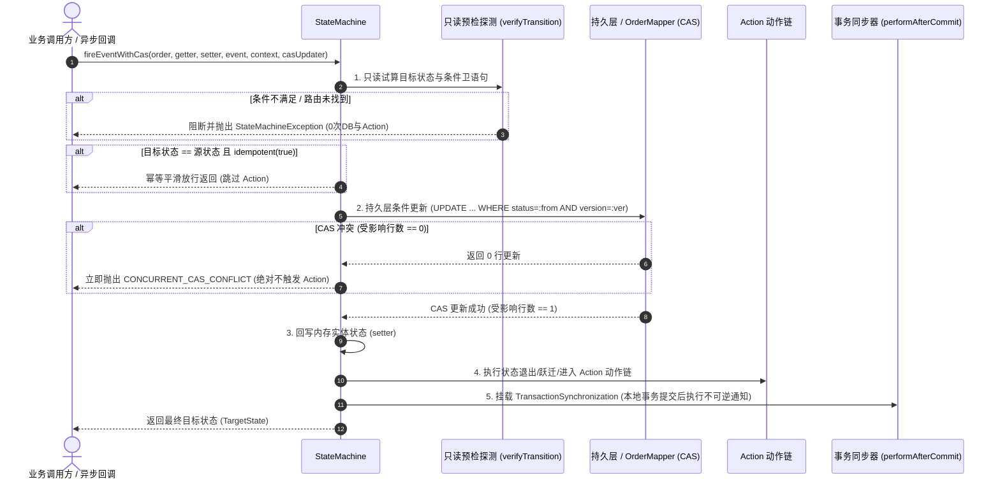

# ateng-boot-statemachine 基础设施 Starter

> 面向复杂业务生命周期治理与订单履约的高性能轻量无状态业务状态机 Starter，坚持纯原生零重型依赖设计，提供强类型 Fluent DSL 规则编排（外部主干跃迁、内部自跃迁、Choice 动态分支、多源汇聚跃迁与状态节点 Entry/Exit 生命周期）、纯只读零副作用预检探测（`canFire` / `verifyTransition` / `getAvailableEvents`）、CAS 乐观锁前置并发防重（`StateMachineCasTemplate`）、声明式幂等放行（`idempotent(true)`）、Spring 本地事务提交后不可逆通知（`performAfterCommit`）、大批量切片流转引擎（`fireEventBatch`）、专职轨迹审计监听器 SPI（`StateTransitionAuditListener`）、三阶段切面拦截器 SPI（`StateMachineInterceptor`）及动态 Mermaid / PlantUML 状态拓扑图导出（参见 [ADR-0051](../docs/adr/0051-high-performance-stateless-business-state-machine-architecture.md)、[ADR-0080](../docs/adr/0080-statemachine-full-scenario-hardening-and-resilient-governance-architecture.md) 与 [ADR-0102](../docs/adr/0102-statemachine-sample-multi-controller-and-documentation-specification-architecture.md)）。

---

## 0. 特性与公共 API 全景速查矩阵 (Feature & API Panorama Matrix)

| 特性分类 | 特性名称 | 核心门面 / 注解 / SPI | 关键配置项 (`ateng.boot.statemachine.*`) | 关键 API 签名 / 核心行为 | 锚定验证源头 (*Test / Sample) |
| :--- | :--- | :--- | :--- | :--- | :--- |
| **DSL 编排** | 构建器工厂门面 | `StateMachineBuilder` / `StateMachineBuilderFactory` | - | `StateMachineBuilder.builder()` / `StateMachineBuilderFactory.create()`，创建全新强类型 Fluent DSL 构建器 | `StateMachineBuilderTest` / `OrderStateMachineConfig` |
| **DSL 编排** | 外部主干跃迁装配 | `ExternalTransitionBuilder` | - | `externalTransition().from(S).to(S).on(E).when(Condition).perform(Action)`，声明标准外部状态流转（$S_1 \to S_2$） | `ExternalTransitionTest` / `OrderLifecycleIntegrationTest` |
| **DSL 编排** | 内部自跃迁装配 | `InternalTransitionBuilder` | - | `internalTransition().from(S).on(E).when(Condition).perform(Action)`，声明内部自流转（$S_1 \to S_1$ 保持主状态不变执行属性更新） | `InternalTransitionTest` / `OrderLifecycleIntegrationTest` |
| **DSL 编排** | 多源汇聚跃迁装配 | `MultiFromTransitionBuilder` | - | `multiFromTransition().from(S...).to(S).on(E).when(Condition).perform(Action)`，声明多前置状态统一收敛跃迁 | `MultiFromTransitionTest` / `OrderLifecycleIntegrationTest` |
| **DSL 编排** | Choice 条件分支路由 | `ChoiceTransitionBuilder` | - | `choiceTransition().from(S).on(E).when(Condition).to(S).defaultTo(S).perform(Action)`，声明多分支动态分流路由 | `ChoiceTransitionTest` / `OrderLifecycleIntegrationTest` |
| **DSL 编排** | 状态节点生命周期 | `StateLifecycleBuilder` | - | `state(S).onEntry(Action).onExit(Action)`，定义状态节点进入与退出生命周期动作，遵循标准 UML 语义 | `StateLifecycleTest` / `OrderLifecycleIntegrationTest` |
| **DSL 编排** | 声明式幂等放行 | `TransitionBuilder` / `StateMachineBuilder` / `IdempotentStrategy` | - | `.idempotent(true)`、`.idempotent(IdempotentStrategy)` 或构建器级 `idempotentStrategy(...)`，当前状态已是目标状态时放行重复事件，跳过 Action 执行 | `IdempotentTransitionTest` / `PaymentCallbackScenarioService` |
| **DSL 编排** | 事务提交后动作同步 | `ExternalTransitionBuilder` / `ChoiceTransitionBuilder` | - | `.performAfterCommit(Action)`，注册挂载 Spring `TransactionSynchronizationManager.afterCommit` 钩子 | `PostCommitActionTest` / `PaymentCallbackScenarioService` |
| **DSL 编排** | 审计与拦截器挂载 | `StateMachineBuilder` | - | `registerAuditListener(...)` 挂载审计监听器；`interceptor(...)` 挂载切面；`build(machineId)` 构建只读机台 | `StateTransitionAuditListenerTest` / `OrderStateMachineConfig` |
| **只读预检** | 流转可行性探测 | `StateMachine<S, E, C>` | - | `canFire(S, E, C)` / `canFire(T, getter, E, C)`，纯只读校验卫语句，强保证 0 次 Action 执行与 0 次 DB 修改 | `ReadOnlyProbeTest` / `OrderProbeScenarioService` |
| **只读预检** | 目标状态推演 | `StateMachine<S, E, C>` | - | `verifyTransition(S, E, C)` / `verifyTransition(T, getter, E, C)`，试算目标状态与卫语句，Guard 异常安全降级容错 | `ReadOnlyProbeTest` / `OrderProbeScenarioService` |
| **只读预检** | 可用事件反查 | `StateMachine<S, E, C>` | - | `getAvailableEvents(S, C)`，反查当前状态下所有条件满足的合法事件集合，供前端动态渲染按钮权限 | `ReadOnlyProbeTest` / `OrderProbeScenarioService` |
| **核心门面** | Fail-Fast 驱动跃迁 | `StateMachine<S, E, C>` | - | `fireEvent(S, E, C)`，驱动单状态跃迁，未找到路由或校验不通过时显式抛出 `StateMachineException` | `StateMachineTest` / `OrderLifecycleIntegrationTest` |
| **核心门面** | 安全探测静默跃迁 | `StateMachine<S, E, C>` | - | `fireEventQuietly(S, E, C)`，静默试算跃迁路由与卫语句，返回不可变 `TransitionResult<S>` 结构化结果 | `StateMachineTest` / `StateMachineCasTemplateTest` |
| **核心门面** | 实体零侵入 Lambda 驱动 | `StateMachine<S, E, C>` | - | `fireEvent(T, Function<T,S>, BiConsumer<T,S>, E, C)`，自动通过 Getter 提取状态并在成功后通过 Setter 回写实体 | `EntityLambdaAccessorTest` / `OrderLifecycleScenarioService` |
| **核心门面** | CAS 乐观锁防重门面 | `StateMachine<S, E, C>` | - | `fireEventWithCas(T, getter, setter, E, C, CasUpdater)`，CAS-First 安全时序更新持久层并执行 Action | `StateMachineCasTemplateTest` / `PaymentCallbackScenarioService` |
| **核心门面** | CAS 静默安全探测门面 | `StateMachine<S, E, C>` | - | `fireEventWithCasQuietly(T, getter, setter, E, C, CasUpdater)`，静默执行 CAS 跃迁与持久化并返回结果 | `StateMachineCasTemplateTest` |
| **核心门面** | 大批量切片流转引擎 | `StateMachine<S, E, C>` | - | `fireEventBatch(List<T>, getter, setter, E, C, BatchOptions)`，基于 Core `BatchSliceUtil` 分批切片执行并聚合回执 | `BatchTransitionEngineTest` / `OrderTimeoutBatchScenarioService` |
| **核心门面** | 动态 Mermaid 图例导出 | `StateMachine<S, E, C>` | - | `generateMermaid()` / `exportMermaidDiagram()`，实时输出 Mermaid `stateDiagram-v2` 状态拓扑图语法文本 | `MermaidExportTest` / `OrderLifecycleIntegrationTest` |
| **核心门面** | 动态 PlantUML 图例导出 | `StateMachine<S, E, C>` | - | `generatePlantUML()`，实时输出 PlantUML `@startuml ... @enduml` 状态拓扑图语法文本 | `MermaidExportTest` / `OrderLifecycleIntegrationTest` |
| **并发防重** | CAS 执行模板引擎 | `StateMachineCasTemplate` | - | `execute(...)` 与 `executeQuietly(...)`，协调只读预检试算、持久层条件更新与 Action 有序调度 | `StateMachineCasTemplateTest` / `PaymentCallbackScenarioService` |
| **并发防重** | CAS 条件更新器函数 | `CasUpdater<T, S>` | - | `updateWithCas(T entity, S sourceState, S targetState)`，对应持久层原子 SQL 条件更新契约 | `StateMachineCasTemplateTest` / `OrderMapper` |
| **全局工厂** | 状态机单例注册表 | `StateMachineFactory` | - | `get(id)`、`contains(id)`、`getAllMachineIds()`、`size()`、`registerOrUpdate(m)`、`unregister(id)`，支持容器内省 | `StateMachineFactoryTest` / `OrderLifecycleIntegrationTest` |
| **机台治理** | 拦截器与审计动态治理 | `StateMachine<S, E, C>` | - | `addInterceptor(...)`、`removeInterceptor(...)`、`getInterceptors()`、`addAuditListener(...)`、`removeAuditListener(...)`、`getAuditListeners()`，对称治理与安全去重 | `StateTransitionAuditListenerTest` / `StateMachineInterceptorTest` |
| **扩展 SPI** | 轨迹审计监听器 | `StateTransitionAuditListener<S, E, C>` | - | `onTransitionCompleted(TransitionAuditEvent)`、`supports(machineId)`，机台隔离守护、异步持久化流转轨迹审计日志、全链路行为追踪与外部数仓上报 | `StateTransitionAuditListenerTest` / `OrderTransitionAuditLogger` |
| **扩展 SPI** | 执行切面拦截器 | `StateMachineInterceptor<S, E, C>` | - | `beforeTransition`、`afterTransition`、`onException`，三阶段生命周期切面拦截点 | `StateMachineInterceptorTest` / `AtengStateMachineAutoConfiguration` |
| **内置拦截器** | 脱敏与耗时日志切面 | `LoggingStateMachineInterceptor` | `ateng.boot.statemachine.logging.enabled`<br>`ateng.boot.statemachine.logging.log-context` | 联动 MDC `traceId` 与 `DesensitizeUtil` 对状态机入站跃迁、上下文及执行耗时进行受控安全日志打印 | `LoggingStateMachineInterceptorTest` / `AtengStateMachineAutoConfigurationTest` |
| **内置拦截器** | Micrometer 指标度量切面 | `MetricsStateMachineInterceptor` | `ateng.boot.statemachine.metrics.enabled` | 自动向 Micrometer 注册 Counter 统计总跃迁数与失败数，并通过 Timer 监控跃迁延时分布 | `MetricsStateMachineInterceptorTest` / `AtengStateMachineAutoConfigurationTest` |
| **自动装配** | 状态机自动装配引导类 | `AtengStateMachineAutoConfiguration` | `ateng.boot.statemachine.enabled` | 自动化注册配置类、Logging 拦截器、平滑探测 Metrics 嵌套配置与机台容器生命周期初始化器 | `AtengStateMachineAutoConfigurationTest` / `SampleStateMachineApplicationTest` |
| **生命周期** | 容器机台初始化器 | `StateMachineInitializer` | - | 容器刷新后自动扫描 Spring 容器内所有 `StateMachine` Bean，装配切面、审计监听器并注册至 `StateMachineFactory` | `AtengStateMachineAutoConfigurationTest` / `OrderLifecycleIntegrationTest` |
| **结果模型** | 跃迁执行结果载荷 | `TransitionResult<S>` | - | `isAccepted()` / `isSuccess()`、`isIdempotent()`、`getSourceState()`、`getTargetState()`、`getEvent()`、`getCause()`、`getResultCode()` | `TransitionResultTest` / `OrderLifecycleIntegrationTest` |
| **结果模型** | 轨迹审计事件对象 | `TransitionAuditEvent<S, E, C>` | - | `getMachineId()`、`getFromState()`、`getToState()`、`getEvent()`、`getOperator()`、`getTraceId()`、`getElapsed()`、`isSuccess()`、`getCause()` | `StateTransitionAuditListenerTest` / `OrderLifecycleIntegrationTest` |
| **结果模型** | 批量切片聚合回执 | `BatchTransitionResult<S, T>` | - | `getTotalCount()`、`getSuccessCount()`、`getFailureCount()`、`getSuccessEntities()`、`getFailures()`、`isAllSuccess()` | `BatchTransitionEngineTest` / `OrderLifecycleIntegrationTest` |
| **结果码契约** | 专属错误码枚举 | `StateMachineResultCode` | - | `TRANSITION_NOT_FOUND(59001)`、`CONDITION_FAILED(59002)`、`ACTION_EXECUTION_FAILED(59003)`、`DUPLICATE_MACHINE_ID(59004)`、`CONCURRENT_CAS_CONFLICT(59005)`、`MACHINE_NOT_FOUND(59006)`、`BATCH_TRANSITION_FAILED(59007)`、`STATE_LIFECYCLE_FAILED(59008)` | `StateMachineResultCodeTest` |
| **异常体系** | 专属受控业务异常 | `StateMachineException` | - | 继承 `BusinessException`，携带 `resultCode`、`fromState`、`targetState`、`event` 与原始 `cause` | `StateMachineExceptionTest` |

---

## 1. 模块定位与快速起步 (Module Positioning & Quickstart)

`ateng-boot-statemachine` 是面向企业级复杂业务流转与履约生命周期治理的高性能轻量无状态状态机底座：
- **纯原生无重依赖哲学 (Zero-Bloat Invariant)**：100% 依托 JDK 17 与 Spring 6 原生算力，绝不引入 Spring StateMachine、Squirrel 等重量级流程引擎，杜绝字节码与类加载膨胀；
- **严格无状态与线程安全不变量 (Stateless Invariant)**：状态机机台全局单例且严格不可变，内存仅维护静态规则路由拓扑，业务状态完全收敛于外部实体或数据库；
- **显式强类型契约与 5 大流转拓扑**：提供 Fluent DSL 声明外部主干流转（`externalTransition`）、内部自跃迁更新物理字段（`internalTransition`）、多源汇聚（`multiFromTransition`）、Choice 动态风控条件分流（`choiceTransition`）与状态节点进出生命周期（`state(S).onEntry/onExit`）；
- **CAS-First 安全时序与并发防重**：原生协同数据库条件更新（`UPDATE ... WHERE status = :from AND version = :ver`），防范并发重复点击；CAS 更新成功后再行执行 Action 动作链，杜绝并发冲突下的虚假副作用；
- **声明式幂等策略与事务提交后动作同步**：支持 `.idempotent(true)` 优雅放行重复回调；支持 `.performAfterCommit` 注册 Spring 本地事务提交后钩子，彻底杜绝本地回滚导致的外部不可逆短信/履约幽灵单边账；
- **大批量切片流转与轨迹审计 SPI**：提供 `fireEventBatch` 切片批处理引擎并聚合回执；提供 `StateTransitionAuditListener` 专职审计监听器，保障全链路行为可追溯。

### Maven 坐标引入

在已导入 `ateng-boot-bom` 的工程中，无需声明版本号即可直接引入：

```xml
<dependency>
    <groupId>io.github.atengk</groupId>
    <artifactId>ateng-boot-statemachine</artifactId>
</dependency>
```

### 极简起步示例 (3 步就绪)

以下代码 100% 逆向提取自场景样例工程 [`ateng-boot-sample-statemachine`](../ateng-boot-samples/ateng-boot-sample-statemachine)。

#### 步骤一：配置应用属性 (`application.yml`)

```yaml
ateng:
  boot:
    statemachine:
      enabled: true
      logging:
        enabled: true
        log-context: true
      metrics:
        enabled: true
```

#### 步骤二：声明强类型状态机编排 (`OrderStateMachineConfig.java`)

```java
@Configuration
public class OrderStateMachineConfig {

    public static final String MACHINE_ID = "ORDER_LIFECYCLE";

    @Bean
    public StateMachine<OrderState, OrderEvent, OrderContext> orderStateMachine() {
        StateMachineBuilder<OrderState, OrderEvent, OrderContext> builder = StateMachineBuilder.builder();

        // 外部主干跃迁：WAIT_PAY -> PAID (PAY)，配置声明式幂等与事务提交后通知
        builder.externalTransition()
                .from(OrderState.WAIT_PAY)
                .to(OrderState.PAID)
                .on(OrderEvent.PAY)
                .idempotent(true)
                .when(ctx -> ctx != null && ctx.getAmount() != null)
                .perform((from, to, event, ctx) -> log.info("[Action] 订单支付成功: orderSn={}, amount={}", ctx.getOrderSn(), ctx.getAmount()))
                .performAfterCommit((from, to, event, ctx) -> log.info("[PostCommit] 触发外部不可逆短信/履约通知: orderSn={}", ctx.getOrderSn()));

        return builder.build(MACHINE_ID);
    }
}
```

#### 步骤三：业务服务中驱动流转 (`OrderLifecycleScenarioService.java`)

```java
@Service
public class OrderLifecycleScenarioService {

    private final StateMachine<OrderState, OrderEvent, OrderContext> orderStateMachine;
    private final OrderMapper orderMapper;

    public OrderLifecycleScenarioService(StateMachine<OrderState, OrderEvent, OrderContext> orderStateMachine, OrderMapper orderMapper) {
        this.orderStateMachine = orderStateMachine;
        this.orderMapper = orderMapper;
    }

    public TransitionResult<OrderState> pay(Long orderId) {
        OrderDO order = orderMapper.selectById(orderId);
        OrderContext context = OrderContext.builder()
                .orderId(order.getId())
                .orderSn(order.getOrderSn())
                .amount(order.getAmount())
                .operator("BUYER")
                .build();

        // 驱动状态机跃迁并回写实体
        OrderState targetState = orderStateMachine.fireEvent(
                order,
                OrderDO::getStatus,
                OrderDO::setStatus,
                OrderEvent.PAY,
                context
        );
        orderMapper.updateById(order);
        return TransitionResult.success(OrderState.WAIT_PAY, targetState, OrderEvent.PAY);
    }
}
```

---

## 2. 核心架构与设计不变量 (Core Architecture & Stateless Design Invariants)

### 电商订单全生命周期拓扑

`ateng-boot-statemachine` 支持外部主干跃迁、内部自跃迁、多源汇聚、Choice 动态分支及节点 Entry/Exit 生命周期：


```mermaid
stateDiagram-v2
    [*] --> WAIT_PAY : 创建订单
    WAIT_PAY --> PAID : PAY [买家付款]
    PAID --> Choice1 : RISK_AUDIT [风控评估]
    Choice1 --> WAIT_DELIVER : 风控正常 (score < 80)
    Choice1 --> REFUNDING : 高风险拦截 (score >= 80)
    WAIT_DELIVER --> DELIVERING : SHIP [商家发货]
    DELIVERING --> DELIVERING : ADD_TRACKING [内部自跃迁·追加物流轨迹]
    DELIVERING --> DELIVERED : CONFIRM_DELIVERY [买家妥投签收]
    DELIVERED --> FINISHED : FINISH [交易完成归档]
    WAIT_PAY --> CLOSED : CANCEL [多源取消]
    PAID --> CLOSED : CANCEL [多源取消]
    WAIT_DELIVER --> CLOSED : CANCEL [多源取消]
    PAID --> REFUNDING : APPLY_REFUND [多源退款]
    WAIT_DELIVER --> REFUNDING : APPLY_REFUND [多源退款]
    REFUNDING --> CLOSED : FINISH [退款完成]
```

### CAS-First 乐观锁并发安全时序

状态机在处理并发事件时，严格遵守 CAS-First 执行时序，杜绝传统“先 Action 后更新 DB”导致的虚假副作用与幽灵脏数据：


```mermaid
sequenceDiagram
    autonumber
    actor Caller as 业务调用方 / 异步回调
    participant SM as StateMachine
    participant Probe as 只读预检探测 (verifyTransition)
    participant DB as 持久层 / OrderMapper (CAS)
    participant Action as Action 动作链
    participant Sync as 事务同步器 (performAfterCommit)

    Caller->>SM: fireEventWithCas(order, getter, setter, event, context, casUpdater)
    SM->>Probe: 1. 只读试算目标状态与条件卫语句
    alt 条件不满足 / 路由未找到
        Probe-->>Caller: 阻断并抛出 StateMachineException (0次DB与Action)
    end
    alt 目标状态 == 源状态 且 idempotent(true)
        SM-->>Caller: 幂等平滑放行返回 (跳过 Action)
    end
    SM->>DB: 2. 持久层条件更新 (UPDATE ... WHERE status=:from AND version=:ver)
    alt CAS 冲突 (受影响行数 == 0)
        DB-->>SM: 返回 0 行更新
        SM-->>Caller: 立即抛出 CONCURRENT_CAS_CONFLICT (绝对不触发 Action)
    end
    DB-->>SM: CAS 更新成功 (受影响行数 == 1)
    SM->>SM: 3. 回写内存实体状态 (setter)
    SM->>Action: 4. 执行状态退出/跃迁/进入 Action 动作链
    SM->>Sync: 5. 挂载 TransactionSynchronization (本地事务提交后执行不可逆通知)
    SM-->>Caller: 返回最终目标状态 (TargetState)
```

---

## 3. 状态机 Fluent DSL 规则编排与拓扑套件 (Capability Domain 1: Fluent DSL Orchestration)

### 3.1 外部主干状态跃迁 (External Transition)

用于声明标准的状态流转（$S_1 \to S_2$），跃迁成功后实体离开原状态并进入新状态，按序触发源状态 `onExit`、跃迁 `perform` 与目标状态 `onEntry`。

```yaml
ateng:
  boot:
    statemachine:
      enabled: true # 开启状态机自动装配
```

```java
// 外部主干跃迁：WAIT_DELIVER -> DELIVERING (SHIP)
builder.externalTransition()
        .from(OrderState.WAIT_DELIVER)
        .to(OrderState.DELIVERING)
        .on(OrderEvent.SHIP)
        .when(ctx -> ctx != null && ctx.getTrackingNo() != null && !ctx.getTrackingNo().isBlank())
        .perform((from, to, event, ctx) -> log.info("[Action] 订单发货出库: orderSn={}, trackingNo={}", ctx.getOrderSn(), ctx.getTrackingNo()));
```

> [!NOTE]
> **机制与边界防御**：`when(Condition)` 卫语句在流转前求值；若返回 `false`，则抛出 `CONDITION_FAILED(59002)` 业务异常，当前状态保持不变且不执行后续动作。

---

### 3.2 内部自状态跃迁 (Internal Transition)

用于主状态保持不变（$S_1 \to S_1$）但需要更新实体内部字段或追加轨迹的场景（如追加物流备注、修改收件地址）。

```yaml
ateng:
  boot:
    statemachine:
      enabled: true
```

```java
// 内部自跃迁：DELIVERING -> DELIVERING (ADD_TRACKING) 保持状态不变
builder.internalTransition()
        .from(OrderState.DELIVERING)
        .on(OrderEvent.ADD_TRACKING)
        .when(ctx -> ctx != null && ctx.getTrackingRemark() != null && !ctx.getTrackingRemark().isBlank())
        .perform((from, to, event, ctx) -> log.info("[Action-Internal] 追加物流动态: orderSn={}, remark={}", ctx.getOrderSn(), ctx.getTrackingRemark()));
```

> [!IMPORTANT]
> **UML 语义边界**：内部自跃迁（`internalTransition`）由于未发生状态节点的移出与再进入，**严格豁免触发 `onExit` 与 `onEntry` 生命周期动作**，仅执行其自身定义的 `perform(Action)`。

---

### 3.3 Choice 动态条件分支路由 (Choice Transition)

在同一源状态和事件下，依据运行时上下文多维参数动态求值，分流走向不同目标状态（$S_1 \xrightarrow{E} \text{if } C_1 \implies S_2 \text{ else } S_3$）。

```yaml
ateng:
  boot:
    statemachine:
      enabled: true
```

```java
// Choice 动态条件分支路由：PAID -> (风控评估) -> REFUNDING(高风险拦截) / WAIT_DELIVER(正常放行)
builder.choiceTransition()
        .from(OrderState.PAID)
        .on(OrderEvent.RISK_AUDIT)
        .when(ctx -> ctx != null && ctx.getRiskScore() != null && ctx.getRiskScore() >= 80)
        .to(OrderState.REFUNDING)
        .defaultTo(OrderState.WAIT_DELIVER)
        .perform((from, to, event, ctx) -> log.info("[Action] 订单风控评估完成: orderSn={}, 流转结果={} -> {}", ctx.getOrderSn(), from, to));
```

> [!NOTE]
> **机制与边界防御**：Choice 分支路由支持多条 `when(...).to(...)` 条件链；若所有条件均不满足，自动回退到 `defaultTo(S)` 保底分支；若未配置 `defaultTo` 且无分支命中，抛出 `TRANSITION_NOT_FOUND(59001)`。

---

### 3.4 多源汇聚跃迁收敛 (Multi-From Transition)

支持多个不同的源状态（$[S_1, S_2, S_3]$）在响应同一事件时统一收敛流向同一目标状态（$S_n$），消除笛卡尔积样板代码。

```yaml
ateng:
  boot:
    statemachine:
      enabled: true
```

```java
// 多源汇聚跃迁：[WAIT_PAY, PAID, WAIT_DELIVER] 统一汇聚流向 CLOSED (CANCEL)
builder.multiFromTransition()
        .from(OrderState.WAIT_PAY, OrderState.PAID, OrderState.WAIT_DELIVER)
        .to(OrderState.CLOSED)
        .on(OrderEvent.CANCEL)
        .perform((from, to, event, ctx) -> log.info("[Action-MultiFrom] 订单取消并关闭: orderSn={}, 原状态={}", ctx.getOrderSn(), from));
```

> [!TIP]
> **机制与边界防御**：多源汇聚在内部展开为独立的不可变路由规则，具备完整的前置条件校验与异常隔离能力。

---

### 3.5 状态节点 Entry / Exit 生命周期 (State Lifecycle)

绑定于状态节点本身的进入（`onEntry`）与离开（`onExit`）动作钩子，凡经由外部跃迁进入或离开该状态时统一自动触发。

```yaml
ateng:
  boot:
    statemachine:
      enabled: true
```

```java
// 状态节点 Entry / Exit 生命周期动作
builder.state(OrderState.WAIT_DELIVER)
        .onEntry((from, to, event, ctx) -> log.info("[State-Entry] 进入待发货状态: orderSn={}", ctx.getOrderSn()))
        .onExit((from, to, event, ctx) -> log.info("[State-Exit] 离开待发货状态: orderSn={}", ctx.getOrderSn()));
```

> [!WARNING]
> **异常传递机制**：若 `onExit` 或 `onEntry` 抛出未捕获异常，将中断后续流转并封装为 `STATE_LIFECYCLE_FAILED(59008)` 抛出，保障生命周期的严谨性。

---

## 4. 零副作用只读探测与动态权限套件 (Capability Domain 2: Zero-Side-Effect Read-Only Probes)

### 4.1 流转可行性只读探测 (`canFire`)

纯只读校验卫语句，强保证 0 次 Action 执行与 0 次数据库修改，专供前端按钮灰化或工作流前置判断。

```yaml
ateng:
  boot:
    statemachine:
      enabled: true
```

```java
// 探测指定事件是否允许从当前状态流转
boolean canPay = orderStateMachine.canFire(order.getStatus(), OrderEvent.PAY, context);

// 实体便捷重载
boolean canShip = orderStateMachine.canFire(order, OrderDO::getStatus, OrderEvent.SHIP, context);
```

> [!NOTE]
> **机制与边界防御**：`canFire` 期间若条件卫语句（Guard `Condition`）发生未捕获异常，门面自动降级返回 `false`，绝不因卫语句代码缺陷导致业务线程崩溃。

---

### 4.2 目标状态推演与卫语句安全容错 (`verifyTransition`)

试算推演目标状态与卫语句，输出不可变 `TransitionResult<S>` 结构化结果。

```yaml
ateng:
  boot:
    statemachine:
      enabled: true
```

```java
// 试算推演流转结果（绝对不执行 Action 与数据库写操作）
TransitionResult<OrderState> result = orderStateMachine.verifyTransition(
        order.getStatus(),
        OrderEvent.RISK_AUDIT,
        context
);

if (result.isAccepted()) {
    log.info("推演目标状态: {}", result.getTargetState());
} else {
    log.warn("不可流转原因: {}", result.getFailureReason());
}
```

> [!NOTE]
> **机制与边界防御**：`verifyTransition` 返回完整的 `resultCode`、`targetState` 与因果链，适合面向管理后台呈现“为何当前按钮不可用”的详细提示。

---

### 4.3 可用事件反查与动态按钮权限控制 (`getAvailableEvents`)

反查当前订单状态下所有条件满足的合法事件集合，供前端动态渲染操作按钮与权限控制。

```yaml
ateng:
  boot:
    statemachine:
      enabled: true
```

```java
// 反查当前状态下所有合法可用的事件列表
List<OrderEvent> availableEvents = orderStateMachine.getAvailableEvents(order.getStatus(), context);

// 转换为前端按钮权限视图对象 (OrderButtonActionVO)
Map<String, Boolean> buttonPermissions = Map.of(
        "pay", availableEvents.contains(OrderEvent.PAY),
        "ship", availableEvents.contains(OrderEvent.SHIP),
        "cancel", availableEvents.contains(OrderEvent.CANCEL)
);
```

> [!TIP]
> **性能考量**：反查方法在单机台毫秒内即可完成全部路由遍历求值，无锁无阻塞，适合挂载至订单详情页接口高频调用。

---

## 5. CAS 乐观锁并发防重与事务同步套件 (Capability Domain 3: CAS Optimistic Locking & Transaction Hooks)

### 5.1 CAS-First 乐观锁并发安全流转 (`fireEventWithCas`)

协同数据库原子条件更新（`UPDATE ... WHERE status = :from AND version = :ver`），防范高并发重复点击导致状态乱跳。

```yaml
ateng:
  boot:
    statemachine:
      enabled: true
```

```java
// CAS 乐观锁前置时序防重
OrderState targetState = orderStateMachine.fireEventWithCas(
        order,
        OrderDO::getStatus,
        OrderDO::setStatus,
        OrderEvent.PAY,
        context,
        (ent, from, to) -> orderMapper.updateStatusWithCas(ent.getId(), from.name(), to.name(), ent.getVersion())
);
```

> [!IMPORTANT]
> **CAS-First 安全执行时序**：
> 1. 先进行只读预检试算目标状态；
> 2. 执行持久层原子条件更新；
> 3. 若受影响行数为 0，立即阻断并抛出 `CONCURRENT_CAS_CONFLICT(59005)`，**绝对不触发任何 Action**；
> 4. CAS 成功后再执行 Action 动作链与回写实体，彻底规避幽灵单边副作用。

---

### 5.2 声明式幂等策略放行 (`idempotent(true)`)

当实体当前状态已是目标状态且接收到重复事件（如外部支付回调网络超时重试投递）时，声明式放行并返回当前状态。

```yaml
ateng:
  boot:
    statemachine:
      enabled: true
```

```java
// 编排阶段声明幂等放行
builder.externalTransition()
        .from(OrderState.WAIT_PAY)
        .to(OrderState.PAID)
        .on(OrderEvent.PAY)
        .idempotent(true) // 开启声明式幂等放行
        .perform((from, to, event, ctx) -> log.info("[Action] 支付成功"));
```

> [!NOTE]
> **机制与边界防御**：当源状态等于目标状态时，`idempotent(true)` 优雅放行并返回不可变 `TransitionResult.idempotent(...)`，跳过 Action 执行，避免向调用方误报路由未找到异常。

---

### 5.3 Spring 本地事务提交后动作同步 (`performAfterCommit`)

依托 Spring 事务同步机制，在本地数据库事务确定性提交（`afterCommit`）后才安全触发外部不可逆副作用（发短信、推 MQ、通知履约）。

```yaml
ateng:
  boot:
    statemachine:
      enabled: true
```

```java
// 注册本地事务提交后执行的不可逆外部通知
builder.externalTransition()
        .from(OrderState.WAIT_PAY)
        .to(OrderState.PAID)
        .on(OrderEvent.PAY)
        .perform((from, to, event, ctx) -> orderMapper.updateById(order))
        .performAfterCommit((from, to, event, ctx) -> {
            // 本地事务 Commit 成功后才触发，若事务 Rollback 则本钩子自动丢弃
            smsClient.sendPaymentSuccessSms(ctx.getOrderSn(), ctx.getAmount());
        });
```

> [!CAUTION]
> **痛点根治**：在 `@Transactional` 方法内若直接发送短信，后续抛异常导致事务回滚时短信无法撤回；`performAfterCommit` 从架构上彻底杜绝外部不可逆通知单边幽灵账。

---

## 6. 大批量切片流转引擎与可观测性套件 (Capability Domain 4: Large-Batch Sliced Transition & Observability)

### 6.1 超时订单大批量切片关单与容错隔离 (`fireEventBatch`)

针对定时任务或流式批处理场景，依托 `ateng-boot-core` 的 `BatchSliceUtil` 将大集合平滑切片（默认 50/200 条），分批执行跃迁并聚合回执。

```yaml
ateng:
  boot:
    statemachine:
      enabled: true
```

```java
// 批量切片关单（Fail-Safe 模式：单笔失败不阻断整批）
BatchTransitionResult<OrderState, OrderDO> result = orderStateMachine.fireEventBatch(
        orders,
        OrderDO::getStatus,
        OrderDO::setStatus,
        OrderEvent.CANCEL,
        context,
        BatchOptions.of(50, false) // 批次大小 50，非快速失败
);

log.info("批量关单汇总: 总数={}, 成功={}, 失败={}",
        result.getTotalCount(), result.getSuccessCount(), result.getFailureCount());
```

> [!NOTE]
> **机制与边界防御**：`BatchTransitionResult` 包含全部成功实体清单及失败项因果异常映射（`Map<T, StateMachineException>`），便于后续对失败订单实施补偿重试。

---

### 6.2 专职流转轨迹审计监听器 SPI (`StateTransitionAuditListener`)

开发者可通过实现 `StateTransitionAuditListener` 扩展点，异步持久化流转轨迹审计日志、全链路行为追踪或上报数仓。

```yaml
ateng:
  boot:
    statemachine:
      enabled: true
```

```java
@Component
public class OrderTransitionAuditLogger implements StateTransitionAuditListener<OrderState, OrderEvent, OrderContext> {

    private static final Logger log = LoggerFactory.getLogger(OrderTransitionAuditLogger.class);

    @Override
    public void onTransitionCompleted(TransitionAuditEvent<OrderState, OrderEvent, OrderContext> event) {
        log.info("[Audit] 状态机 [{}] 跃迁审计: from={} -> to={}, event={}, success={}, traceId={}, 耗时={}ms",
                event.getMachineId(), event.getFromState(), event.getToState(), event.getEvent(),
                event.isSuccess(), event.getTraceId(), event.getElapsed().toMillis());
    }
}
```

> [!NOTE]
> **自动发现机制**：容器启动时，`StateMachineInitializer` 自动发现 Spring 上下文中所有 `StateTransitionAuditListener` Bean，并按机台标识（`supports(machineId)`）自动挂载。

---

### 6.3 MDC 链路追踪与脱敏日志切面拦截器 (`LoggingStateMachineInterceptor`)

联动 MDC `traceId` 与 `DesensitizeUtil` 对状态机入站跃迁、上下文及执行耗时进行受控安全日志打印。

```yaml
ateng:
  boot:
    statemachine:
      logging:
        enabled: true       # 开启状态机流转日志切面
        log-context: true   # 是否在日志中打印脱敏后的 Context 上下文
```

```text
[INFO] [MDC: 58da1625a1b2c3d4] [StateMachine-Log] [ORDER_LIFECYCLE] 准备流转: from=WAIT_PAY, event=PAY, context=OrderContext(orderSn=SO202610100001, amount=199.00)
[INFO] [MDC: 58da1625a1b2c3d4] [StateMachine-Log] [ORDER_LIFECYCLE] 流转成功: WAIT_PAY -> PAID, event=PAY, 耗时=4ms
```

> [!TIP]
> 生产高吞吐场景可将 `log-context` 设置为 `false`，仅输出状态变更与执行耗时，降低日志 I/O 开销。

---

### 6.4 Micrometer 云原生度量监控切面拦截器 (`MetricsStateMachineInterceptor`)

自动向 Micrometer 注册 Counter 统计总跃迁数与失败数，并通过 Timer 监控跃迁延时分布，无缝对接 Prometheus 与 Grafana 看板。

```yaml
ateng:
  boot:
    statemachine:
      metrics:
        enabled: true # 开启 Micrometer 状态机指标度量采集
```

度量指标项速查：
- `statemachine.transitions.total` (Counter)：状态跃迁总次数，按 `machine_id`、`from`、`to`、`event`、`status`（success/failure）打标。
- `statemachine.transitions.duration` (Timer)：跃迁执行耗时分布，按 `machine_id`、`event` 打标。

---

### 6.5 动态 Mermaid / PlantUML 状态机拓扑可视化导出

状态机机台内置实时 Mermaid 与 PlantUML 拓扑图生成引擎，便于动态导出并在控制台可视化展示。

```yaml
ateng:
  boot:
    statemachine:
      enabled: true
```

```java
// 导出 Mermaid 语法文本
String mermaidCode = orderStateMachine.generateMermaid();

// 导出 PlantUML 语法文本
String plantUmlCode = orderStateMachine.generatePlantUML();
```

导出生成的 Mermaid 源码可直接在 Markdown、Apipost 或前端 Vue 组件中渲染展现。

---

## 7. 生产扩展接管与核心非功能边界 (Production Boundary & Customization)

### 7.1 SPI 扩展定制与双通道机台容器内省 (`StateMachineFactory`)

状态机底座提供双通道访问支持，并支持机台数量与已注册 ID 内省：

```java
// 通道一：Spring 容器强类型原生注入（推荐业务单机台场景）
@Autowired
private StateMachine<OrderState, OrderEvent, OrderContext> orderStateMachine;

// 通道二：全局工厂单例查找与内省（推荐微服务动态路由或通用调度引擎）
StateMachine<OrderState, OrderEvent, OrderContext> machine = StateMachineFactory.get("ORDER_LIFECYCLE");

// 容器内省能力
boolean exists = StateMachineFactory.contains("ORDER_LIFECYCLE");
Set<String> allMachineIds = StateMachineFactory.getAllMachineIds();
int machineCount = StateMachineFactory.size();
```

### 7.2 CAS-First 并发时序不变量与防幽灵单边账机制
- **传统时序缺陷**：若先执行 Action（如调用外部发券或扣减积分）再执行 DB CAS 更新，当并发冲突导致 DB 更新返回 0 行时，已执行的 Action 无法完全撤销，导致虚假副作用与单边脏数据；
- **CAS-First 安全执行时序**：
  1. **纯只读预检试算**：调用 `verifyTransition` 试算目标状态并校验条件卫语句，强保证 0 次 Action 执行与 0 次 DB 修改；
  2. **声明式幂等判定**：若当前状态已是目标状态且配置了 `idempotent(true)`，直接平滑放行返回当前状态；
  3. **持久层 CAS 原子更新**：执行 `UPDATE ... WHERE status = :from AND version = :ver`；
  4. **并发冲突熔断**：受影响行数为 0 时，立即阻断并抛出 `CONCURRENT_CAS_CONFLICT(59005)`，**绝对不触发任何 Action**；
  5. **内存回写与动作调度**：CAS 成功后，同步回写内存实体状态并按序触发生命周期与 Action 动作链。

### 7.3 UML 状态节点生命周期语义与内部跃迁免进出豁免
- **外部跃迁执行顺序**：源状态与目标状态不同（$S_1 \to S_2$）或外部自跃迁时，严格遵循 UML 标准规范：
  $$\text{sourceState.onExit} \longrightarrow \text{transition.perform} \longrightarrow \text{targetState.onEntry}$$
- **内部自跃迁免进出豁免**：内部自流转（`internalTransition`，$S_1 \to S_1$ 且不离开主状态）**绝对不触发 `onExit` 与 `onEntry` 动作**，仅执行跃迁 Action。

### 7.4 探测门面 Guard 异常降级与内存防穿透
- `canFire(S, E, C)`、`verifyTransition(S, E, C)` 与 `getAvailableEvents(S, C)` 专供前端动态渲染按钮权限与业务流程试算推演；
- 执行期间**绝对禁止触发任何 Action、外部 RPC、事务同步器或持久层写操作**；
- 当条件卫语句（Guard `Condition`）在预检期间发生非受控未捕获异常时，探测门面自动捕获并安全降级为 `false` / `TransitionResult.failure`，绝不因卫语句逻辑缺陷导致前端页面加载崩溃。

---

## 8. 完整 YAML 配置属性清单与样例 Controller 索引 (Appendix & Controller Mapping)

### 8.1 完整 YAML 属性配置字典

```yaml
ateng:
  boot:
    statemachine:
      # 状态机底座核心开关（默认 true）
      enabled: true
      logging:
        # 是否开启状态机全局流转日志拦截器（默认 true）
        enabled: true
        # 是否在日志中打印序列化后的业务上下文 Context（默认 true，高并发生产可设为 false）
        log-context: true
      metrics:
        # 是否开启 Micrometer 云原生指标度量切面拦截器（默认 true）
        enabled: true
```

### 8.2 Sample 样例工程 5 大 Controller 与 REST 路由速查映射

详见场景样例工程 [`ateng-boot-sample-statemachine`](../ateng-boot-samples/ateng-boot-sample-statemachine) 提供的 21 组全场景 REST 端点：

| Controller 类 | 领域职责 | 核心端点示例 |
| :--- | :--- | :--- |
| `StateMachineOrderController` | 订单生命周期流转 | `POST /sample/statemachine/order/create`<br>`POST /sample/statemachine/order/{orderId}/pay`<br>`POST /sample/statemachine/order/risk-audit`<br>`POST /sample/statemachine/order/ship`<br>`POST /sample/statemachine/order/add-tracking`<br>`POST /sample/statemachine/order/{orderId}/confirm-delivery`<br>`POST /sample/statemachine/order/{orderId}/finish`<br>`POST /sample/statemachine/order/{orderId}/cancel`<br>`POST /sample/statemachine/order/{orderId}/apply-refund` |
| `StateMachineProbeController` | 只读预检探测与动态按钮权限 | `POST /sample/statemachine/probe/can-fire`<br>`POST /sample/statemachine/probe/verify`<br>`GET /sample/statemachine/probe/{orderId}/available-events`<br>`GET /sample/statemachine/probe/{orderId}/button-actions` |
| `StateMachineCallbackController` | 支付异步回调与高并发幂等 | `POST /sample/statemachine/callback/payment`<br>`POST /sample/statemachine/callback/simulate-concurrent` |
| `StateMachineBatchController` | 大批量切片流转与超时关单 | `POST /sample/statemachine/batch/cancel-expired`<br>`POST /sample/statemachine/batch/simulate-partial-failure` |
| `StateMachineTopologyController` | 拓扑图导出与机台单例内省 | `GET /sample/statemachine/topology/mermaid`<br>`GET /sample/statemachine/topology/plantuml`<br>`GET /sample/statemachine/topology/machines` |
